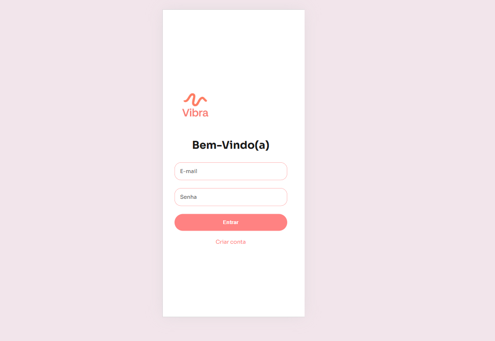
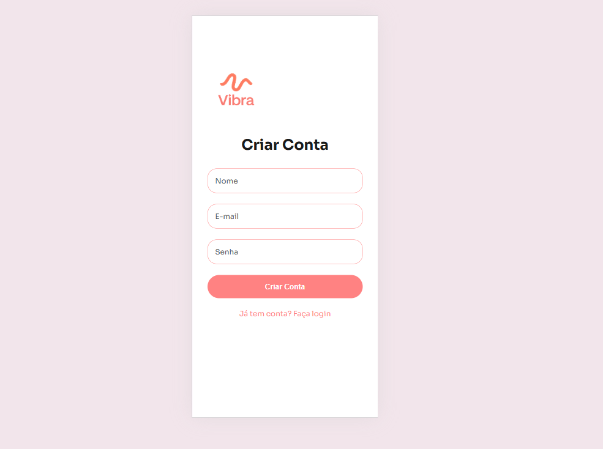
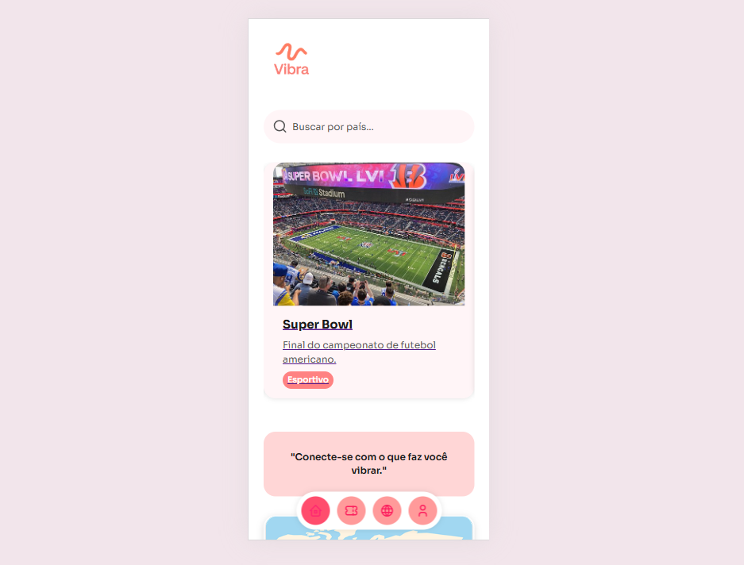
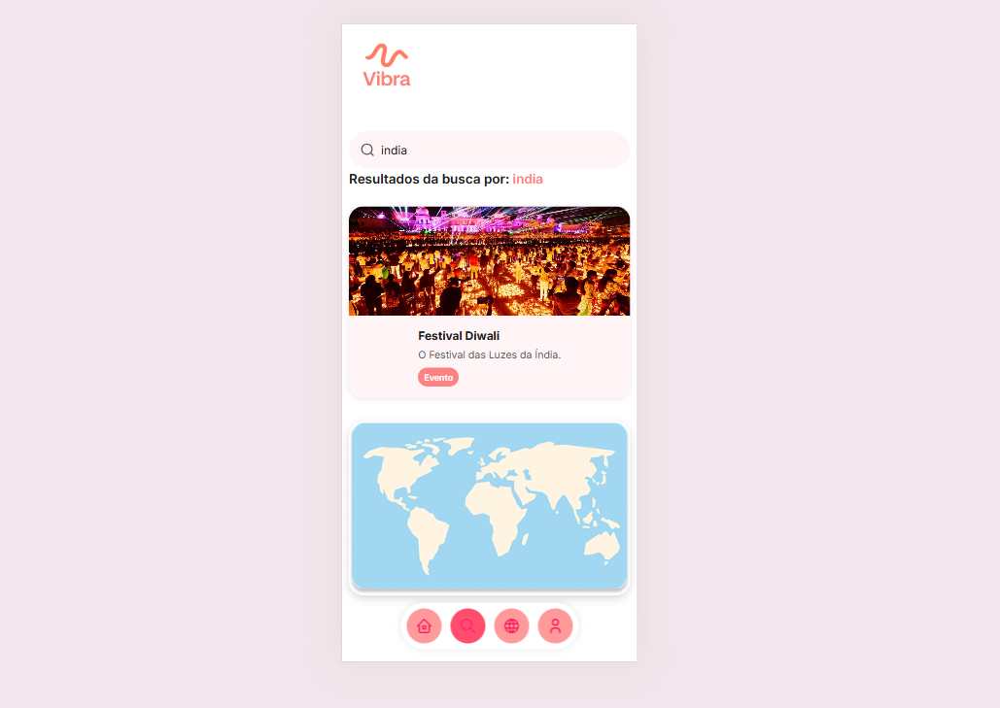
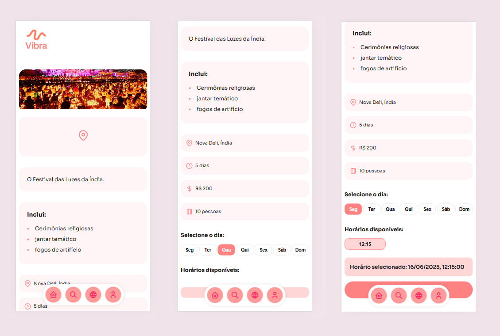
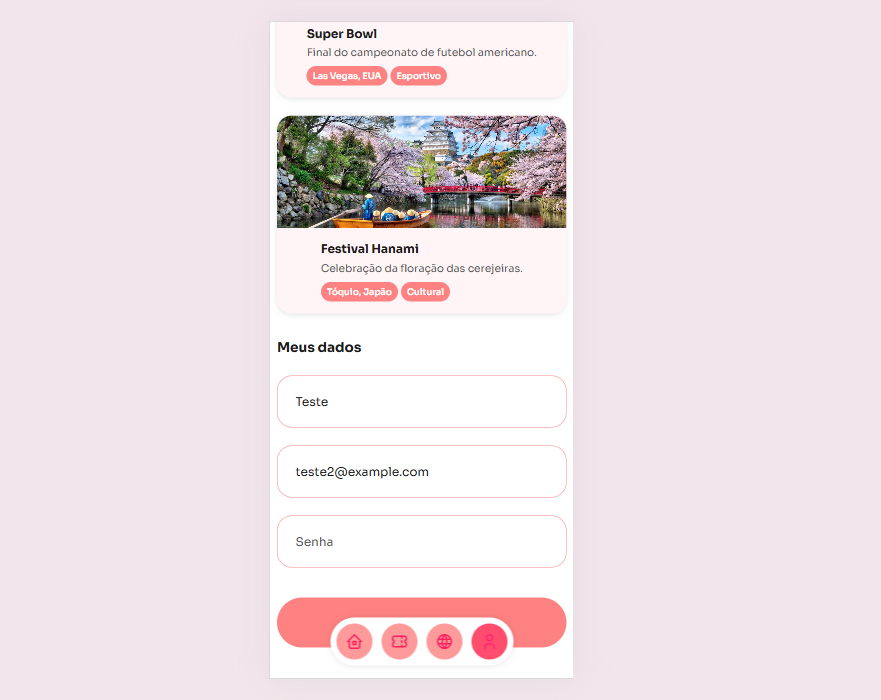

# Web Application Document - Projeto Individual - Módulo 2 - Inteli


## Vibra

#### Aira Mel 

## Sumário

1. [Introdução](#c1)  
2. [Visão Geral da Aplicação Web](#c2)  
3. [Projeto Técnico da Aplicação Web](#c3)  
4. [Desenvolvimento da Aplicação Web](#c4)  
5. [Referências](#c5)  

<br>

## <a name="c1"></a>1. Introdução (Semana 01)

&emsp;A aplicação web **Vibra** nasce da necessidade de oferecer uma experiência moderna, prática e escalável para viajantes e amantes da música. Utilizando apenas uma conexão com a internet, os usuários poderão acessar e gerenciar serviços de qualquer lugar do mundo, promovendo uma verdadeira imersão cultural.

&emsp;O **Vibra** é uma plataforma de eventos com gerenciamento de inscrições, criada para facilitar a conexão entre pessoas e experiências únicas ao redor do mundo. Desenvolvido especialmente para quem ama viajar e viver intensamente cada destino, o aplicativo recomenda eventos exclusivos baseados na localidade da viagem, como tours gastronômicos na Itália, aulas de samba no Rio de Janeiro e corridas emblemáticas em Mônaco.

&emsp;Além disso, a plataforma oferece uma área dedicada a informações culturais rápidas, dicas práticas, idiomas locais e costumes, para preparar o viajante antes de cada experiência. Com o **Vibra**, viajar vai além de conhecer lugares: é viver momentos inesquecíveis, com tudo o que importa na palma da mão.

---

## <a name="c2"></a>2. Visão Geral da Aplicação Web

### 2.1. Personas (Semana 01)

<div align="center">
<sub>Figura 1 - Persona - Vibra </sub>

<sup>Fonte: Autoria Própia, Faculdade Inteli 2025</sup>
</div>

Clara Monteiro é uma viajante conectada de 27 anos, moradora de Barcelona, que busca vivências culturais autênticas em suas viagens. Extrovertida e curiosa, ela evita experiências genéricas e sente frustração ao perder eventos por falta de informação. Suas principais dores envolvem a dificuldade de organizar viagens com foco local e a sensação de não acessar a essência real dos destinos.

Com hábitos digitais ativos em plataformas como Instagram, TikTok e Spotify, Clara espera descobrir eventos únicos de forma rápida, segura e sem burocracia. Suas necessidades principais incluem: inscrições facilitadas e acesso a dicas culturais que enriqueçam sua experiência de viagem.

A aplicação Vibra foi desenhada para atender exatamente a esse perfil: conectando usuários como Clara a eventos, promovendo imersão cultural e experiências inesquecíveis.

### 2.2. User Stories (Semana 01)

Abaixo estão as histórias de usuário que guiam o desenvolvimento da aplicação Vibra, baseadas nas principais dores, comportamentos e objetivos da persona definida.

> US01 | Como uma viajante conectada, quero descobrir eventos únicos enquanto viajo, para que eu possa viver experiências culturais autênticas em cada destino.

> US02 | Como uma viajante conectada, quero me inscrever em eventos de forma rápida e segura, para garantir minha participação sem complicações e evitar filas ou processos demorados.

> US03 | Como uma amante de viagens culturais, quero receber recomendações de eventos, festas e atividades locais baseadas no meu perfil e destino, para otimizar minha experiência e tornar cada viagem inesquecível.

> US04 | Como uma viajante conectada, quero acessar todas as funcionalidades da plataforma diretamente pelo celular, para planejar e interagir com eventos a qualquer momento durante minhas viagens.
<br>

INVEST US02 <br>
**I - Independente**: O sistema de inscrição pode ser desenvolvido separado da descoberta de eventos.

**N - Negociável**: O fluxo de inscrição pode ser ajustado (por exemplo: via app, QR code, confirmação por email).

**V - Valiosa**: Inscrição fácil aumenta a adesão aos eventos.

**E - Estimável**: Consegue-se estimar fluxo de inscrição.

**S - Small**: É um pedaço pequeno e objetivo.

**T - Testável**: Pode-se testar simulando inscrições em eventos.

---

## <a name="c3"></a>3. Projeto da Aplicação Web

### 3.1. Modelagem do banco de dados  (Semana 3)

### **Introdução**
A modelagem de banco de dados da aplicação Vibra foi desenvolvida com o objetivo de estruturar e organizar as informações de forma lógica, funcional e segura. Considerando as principais funcionalidades da plataforma, como gerenciamento de eventos, inscrições, preferências culturais e interação dos usuários, o modelo busca garantir a eficiência no armazenamento, a consistência dos dados e o suporte à escalabilidade da aplicação.

Nesta seção, são apresentados o modelo relacional, que ilustra as entidades, seus atributos e os relacionamentos entre elas. Além disso, o modelo físico, com a estrutura em SQL (schema.sql) pronta para ser implementada em um sistema gerenciador de banco de dados relacional.

### **Modelo Relacional**
O modelo relacional é uma etapa fundamental no processo de modelagem de banco de dados, pois representa de forma clara e organizada as entidades, seus atributos e os relacionamentos entre elas. Ele conecta a análise conceitual e a implementação física do banco de dados, facilitando a visualização da estrutura da informação e permitindo identificar com precisão como os dados interagem dentro do sistema. No contexto da aplicação Vibra, o modelo relacional foi essencial para estruturar os dados de usuários, eventos, localidades, playlists e inscrições, assegurando a integridade das informações e otimizando a experiência do usuário com base em conexões reais e únicas entre cultura, música e viagem.

<div align="center">
<sub>Figura 2 - Modelo Banco de dados - Vibra </sub>

<sup>Fonte: Autoria Própia, Faculdade Inteli 2025</sup>
</div>
<br>

### **Modelo FÍsico**
O modelo físico representa a implementação concreta da estrutura do banco de dados, baseada no que foi definido no modelo relacional. Por meio da linguagem SQL, são criadas as tabelas, os campos e os relacionamentos que tornam possível o armazenamento e a manipulação dos dados dentro da aplicação. No caso da Vibra, o modelo físico foi projetado para garantir desempenho, organização e integridade, permitindo que informações como usuários, eventos, localidades e playlists sejam gerenciadas de forma eficiente.

### **Tabela** 
**Usuários (users)**: Representa as pessoas que utilizam a aplicação web.
- `id`: Identificador único do usuário (PK).
- `name`: Nome do usuário.
- `email`: Endereço de e-mail.
- `password`: Senha de acesso.
- `photo`: Foto de perfil.
- `preferences`: Interesses do usuário.

**Inscrições (subscriptions)**: Representa as inscrições dos usuários nos eventos.
- `id`: Identificador da inscrição (PK).
- `users_id`, `events_id`: Relacionam inscriçoes ao usuário e evento (FK).
- `status`: Situação da inscrição(confirmada, pendente, etc.).

**Feedback (feedbacks)**: Representa os feedbacks dos eventos.
- `id`: Identificador do Feedback (PK).
- `users_id`, `events_id`: Relacionam feedback ao usuário e evento (FK).
- `comments`: Comentário textual.
- `grade`: Nota ou avaliação numérica.
- `when`: Momento do feedback.

**Evento (events)**: Representa eventos cadastrados na aplicação web.
- `id`: Identificador do evento (PK).
- `title`,`type`, `description`, `photo`: Detalhes do evento.
- `when`: Data e hora do evento.
- `locations_id`: Localidade do evento (FK).

**Data e Hora dos Eventos (datetime_events)**: Representa as datas e horas dos eventos.
- `id`: Identificador da data e hora (PK).
- `day_time`: Data e hora do evento.
- `event_id`: Evento relacionado (FK).

**Localidade (locations)**: Representa onde os evetntos acontecem.
- `id`: Identificador da localidade (PK)
- `country``language`, `coin`: Dados culturais do país.
- `customs`, `curiosities`: Costumes e curiosidades.

**Playlist (playlists)**: Representa playlists de músicas de cada localidade.
- `id`: Identificador da playlist (PK).
- `locations_id`: Localidade da playlist (FK).
- `name`: Nome da playlist.
- `link`: Link para a playlist.

```SQL
CREATE TABLE IF NOT EXISTS "users" (
  "id" SERIAL PRIMARY KEY,
  "name" VARCHAR(100),
  "email" VARCHAR(100),
  "password" VARCHAR(255),
  "photo" VARCHAR(255),
  "preferences" VARCHAR(255)
);

CREATE TABLE IF NOT EXISTS "events" (
  "id" INT PRIMARY KEY,
  "title" VARCHAR(100),
  "type" VARCHAR(50),
  "description" VARCHAR(500),
  "photo" VARCHAR(255),
  "locations_id" INT
);

CREATE TABLE IF NOT EXISTS "datetime_events" (
  "id" SERIAL PRIMARY KEY,
  "day_time" TIMESTAMP,
  "event_id" INT,
  CONSTRAINT fk_event FOREIGN KEY (event_id) REFERENCES events(id) ON DELETE CASCADE
);

CREATE TABLE IF NOT EXISTS "locations" (
  "id" INT PRIMARY KEY,
  "country" VARCHAR(100),
  "language" VARCHAR(100),
  "coin" VARCHAR(50),
  "customs" VARCHAR(500),
  "curiosities" VARCHAR(500)
);

CREATE TABLE IF NOT EXISTS "subscriptions" (
  "id" INT PRIMARY KEY,
  "users_id" INT,
  "events_id" INT,
  "date" DATE,
  "hour" TIME,
  "status" VARCHAR(50)
);

CREATE TABLE IF NOT EXISTS "feedbacks" (
  "id" INT PRIMARY KEY,
  "users_id" INT,
  "events_id" INT,
  "comments" VARCHAR(500),
  "grade" DECIMAL,
  "date" DATE,
  "hour" TIME
);

CREATE TABLE IF NOT EXISTS "playlists" (
  "id" INT PRIMARY KEY,
  "locations_id" INT,
  "name" VARCHAR(100),
  "link" VARCHAR(255)
);
```
#### **Relacionamentos e Cardinalidade** 

**Usuário <-> Inscrições** 
- Um usuário pode se inscrever em vários eventos. (1:N)
- Cada inscrição pertence a um usuário.

**Evento <-> Inscrições** 
- Um evento pode ter vários inscritos. (1:N)
- Cada inscrição pertence a um evento.

**Usuário <-> Feedback** 
- Um usuário pode avaliar vários eventos. (1:N)
- Cada feedback pertence a um usuário.

**Evento <-> Feedback** 
- Um evento pode receber vários feedbacks. 
- Cada feedback pertence a um evento.

**Evento <-> Localidade**
- Um local pode receber vários eventos. 
- Cada evento ocorre em uma localidade. (N:1)

**Localidade <-> Playlist**
- Um local pode receber várias playlists. 
- Cada playlist ocorre em uma localidade.

```SQL
-- FKs
ALTER TABLE "subscriptions" ADD FOREIGN KEY ("users_id") REFERENCES "users" ("id");
ALTER TABLE "subscriptions" ADD FOREIGN KEY ("events_id") REFERENCES "events" ("id") ON DELETE CASCADE;

ALTER TABLE "events" ADD FOREIGN KEY ("locations_id") REFERENCES "locations" ("id");

ALTER TABLE "feedbacks" ADD FOREIGN KEY ("users_id") REFERENCES "users" ("id");
ALTER TABLE "feedbacks" ADD FOREIGN KEY ("events_id") REFERENCES "events" ("id");

ALTER TABLE "playlists" ADD FOREIGN KEY ("locations_id") REFERENCES "locations" ("id");

-- Extensões
CREATE EXTENSION IF NOT EXISTS unaccent;
```

A modelagem do banco de dados da aplicação Vibra organiza as entidades principais, como eventos, inscrições, playlists e feedbacks, proporcionando uma experiência fluida para os usuários. A estrutura também facilita futuras expansões, como integração com redes sociais e novos conteúdos.


### 3.1.1 BD e Models (Semana 5)

#### BD

O arquivo `db.js` é responsável por configurar e gerenciar a conexão com o banco de dados **PostgreSQL** utilizado na aplicação Vibra. Ele utiliza a biblioteca `pg`, um cliente PostgreSQL para Node.js, amplamente adotado em projetos web.

```js
const { Pool } = require('pg');
require('dotenv').config();

const isSSL = process.env.DB_SSL === 'true';

const pool = new Pool({
  user: process.env.DB_USER,
  host: process.env.DB_HOST,
  database: process.env.DB_DATABASE,
  password: process.env.DB_PASSWORD,
  port: process.env.DB_PORT,
  ssl: isSSL ? { rejectUnauthorized: false } : false,
});

module.exports = {
  query: (text, params) => pool.query(text, params),
  connect: () => pool.connect(),
};
```
Essa implementação garante que a comunicação com o banco de dados seja feita de forma eficiente, segura e centralizada, promovendo boas práticas no desenvolvimento do backend da aplicação.

#### Models

Nesta etapa do projeto, foram definidos os **models** responsáveis por realizar a comunicação entre a aplicação e o banco de dados **PostgreSQL**, utilizando queries SQL por meio da biblioteca `pg`. Cada model representa uma entidade da aplicação e encapsula as operações CRUD (Create, Read, Update, Delete).

Abaixo, está a tabela que resume os models utilizados, com seus respectivos campos e métodos:

Tabela de Models

| Arquivo               | Entidade       | Campos Principais                                  | Métodos Principais                                  |
|-----------------------|----------------|----------------------------------------------------|-----------------------------------------------------|
| `datetimeEventsModel.js`  | Datas e Horários  | `id`, `day_time`, `event_id`                                  | `findAll()`, `findByEventId()`, `create()`, `update()`, `delete()`          |
| `eventsModel.js`      | Events        | `id`, `title`, `type`, `description`, `photo`, `locations_id` | `findAll()`, `findById()`, `create()`, `update()`, `delete()` |
| `feedbacksModel.js`   | Feedbacks      | `id`, `users_id`, `events_id`, `comments`, `grade` | `findAll()`, `create()`                             |
| `locationsModel.js`   | Locations   | `id`, `country`, `language`, `coin`, `customs`, `curiosities` | `findAll()`, `findById()`                           |
| `playlistsModel.js`   | Playlists      | `id`, `name`, `locations_id`                       | `findByLocationId()`                                |
| `subscriptionsModel.js` | Subscriptions   | `id`, `users_id`, `events_id`, `date`, `hour`, `status` | `findByUserId()`, `create()`                        |
| `usersModel.js`       | Users          | `id`, `name`, `email`, `password`, `photo`, `preferences` | `findByEmail()`, `create()`, `update()`            |


Abaixo, exemplo da estrutura do model `event`, responsável por manipular os dados da tabela `events`.

Arquivo: `models/eventsModel.js`

Este model gerencia os dados dos eventos culturais disponíveis na aplicação. Ele contém métodos para criar, buscar, atualizar e deletar registros da tabela `events`.

**Atributos armazenados:**
- `id`: identificador único do evento (gerado automaticamente)
- `title`: título do evento
- `type`: tipo ou categoria (ex: música, teatro)
- `description`: descrição detalhada do evento
- `photo`: URL de imagem representando o evento
- `locations_id`: referência ao local onde o evento será realizado (chave estrangeira)

**Métodos implementados:**

```js
const db = require('../config/db');

module.exports = {
  async create(data) {
    const query = `
      INSERT INTO events 
        (title, type, description, photo, locations_id, included, place, duration, price, capacity) 
      VALUES ($1, $2, $3, $4, $5, $6, $7, $8, $9, $10) 
      RETURNING *`;
    const values = [data.title, data.type, data.description, data.photo, data.locations_id, data.included, data.place, data.duration, data.price, data.capacity];
    return db.query(query, values);
  },

  async findAll() {
    const result = await db.query(`
      SELECT id, title, type, description, photo, locations_id, included, place, duration, price, capacity 
      FROM events 
      ORDER BY id ASC
    `);
    return result.rows;
  },

  async update(id, data) {
    const query = `
      UPDATE events 
      SET title = $1, type = $2, description = $3, photo = $4, locations_id = $5,
          included = $6, place = $7, duration = $8, price = $9, capacity = $10
      WHERE id = $11 
      RETURNING *`;
    const values = [data.title, data.type, data.description, data.photo, data.locations_id, data.included, data.place, data.duration, data.price, data.capacity, id];
    return db.query(query, values);
  },

  async delete(id) {
    const query = 'DELETE FROM events WHERE id = $1 RETURNING *';
    return db.query(query, [id]);
  },

  async findById(id) {
    const result = await db.query(`
      SELECT id, title, type, description, photo, locations_id, included, place, duration, price, capacity 
      FROM events 
      WHERE id = $1
    `, [id]);
    return result.rows[0];
  }
};
```
A estrutura de **models** implementada no projeto segue princípios sólidos de organização e desacoplamento da lógica de acesso a dados. Cada model representa uma entidade do sistema e encapsula suas operações específicas em módulos separados, garantindo responsabilidades bem definidas e maior legibilidade do código.

Todos os models utilizam o módulo centralizado `db.js`, que gerencia a conexão com o banco de dados **PostgreSQL** por meio da biblioteca `pg`. Isso permite uma comunicação consistente, segura e reutilizável com o banco, evitando duplicação de lógica e facilitando a manutenção.

Essa abordagem está alinhada ao padrão arquitetural **MVC (Model-View-Controller)**, no qual os models atuam como camada de persistência, fornecendo métodos padronizados para as operações **CRUD** da API. A organização modular também favorece a escalabilidade e facilita a implementação de testes automatizados.

A definição clara dos relacionamentos entre entidades, refletidos nos métodos dos models, garante a integridade dos dados e viabiliza funcionalidades como:

- Listagem de eventos com usuários inscritos
- Consulta de eventos em que um usuário está inscrito
- Validação de dados na criação de eventos e usuários


### 3.2. Arquitetura (Semana 5)

O desenvolvimento da aplicação Vibra segue o padrão arquitetural MVC (Model-View-Controller), uma abordagem que separa as responsabilidades da aplicação em três camadas principais: Model, View e Controller. Isso garante maior organização, escalabilidade e facilidade de manutenção do código.

O diagrama abaixo representa a arquitetura da aplicação, evidenciando a forma como os dados fluem entre cliente, servidor e banco de dados:

<div align="center">
<sub>Figura 4 - Diagrama arquitetura MVC - Vibra </sub>

<sup>Fonte: Autoria Própia, Faculdade Inteli 2025</sup>
</div>

#### **View (Visualização)**
A camada de View é responsável pela interface com o usuário. No projeto Vibra, essa camada é composta por arquivos .ejs (Embedded JavaScript Templates), que renderizam dinamicamente os dados fornecidos pelos controllers.

Cada página do sistema — como a listagem de eventos (events.ejs), o detalhamento de um evento (eventPage.ejs) ou o perfil do usuário (profile.ejs) — é construída com foco em responsividade e usabilidade móvel. As views recebem variáveis e objetos do back-end e os exibem com sintaxe EJS, proporcionando uma experiência fluida e personalizada ao usuário.
> ℹ️ **Nota:** A relação entre os controllers e suas respectivas views (EJS) está detalhada na [seção 3.7 – Interface e Navegação](#37-interface-e-navegação).


#### **Controller (Controle)**
Atua como intermediária entre a **View** e o **Model**, sendo responsável por processar as requisições feitas pelos usuários (como criar conta, buscar eventos ou enviar feedback). Os controllers aplicam regras de negócio, validam entradas e, quando necessário, interagem com os models para acessar ou modificar os dados.

No projeto **Vibra**, cada entidade possui um controller específico, o que garante uma organização modular e coesa da lógica da aplicação. São eles:

- `usersController`
- `locationsController`
- `eventsController`
- `subscriptionsController`
- `feedbacksController`
- `playlistsController`
- `datetimeEventsController`

| Controller                   | Responsabilidade Principal                               | Models Relacionados                  |
|-----------------------------|----------------------------------------------------------|--------------------------------------|
| `datetimeEventsController.js` | Controla os dias e horários disponíveis para os eventos  | `datetimeEventsModel`                |
| `eventsController.js`        | Gerencia operações CRUD de eventos culturais             | `eventsModel`, `datetimeEventsModel` |
| `feedbacksController.js`     | Controla o envio e listagem de feedbacks                 | `feedbacksModel`                     |
| `locationsController.js`     | Gerencia dados de localização geográfica                 | `locationsModel`                     |
| `playlistsController.js`     | Lista playlists por localização                          | `playlistsModel`                     |
| `profileController.js`       | Exibe dados do usuário e eventos inscritos no perfil     | `usersModel`, `subscriptionsModel`   |
| `subscriptionsController.js` | Administra inscrições em eventos                         | `subscriptionsModel`                 |
| `usersController.js`         | Gerencia usuários e autenticação                         | `usersModel`                         |
                                              

#### **Model (Modelo)**

A camada responsável por lidar diretamente com a lógica de negócios e com o banco de dados. Cada **model** representa uma tabela no banco PostgreSQL (como `users`, `locations`, `events`, entre outras), incluindo seus atributos e relacionamentos. Além disso, encapsula as operações CRUD (Create, Read, Update, Delete) por meio de queries SQL estruturadas com a biblioteca `pg`.

Esse padrão permite que cada parte da aplicação seja modificada de forma independente. Assim, a arquitetura **MVC** torna o projeto **Vibra** mais modular, seguro e fácil de evoluir conforme novas funcionalidades forem implementadas.

> Para detalhes completos sobre os models e seus métodos, consulte a seção [**3.1.1 BD e Models**](#311-bd-e-models-semana-5).


### 3.3. Wireframes (Semana 03)

Os wireframes são representações visuais simples e estruturadas das telas da aplicação. Eles têm como objetivo demonstrar, de forma clara e organizada, a disposição dos elementos e a arquitetura da interface antes do design final ser aplicado, com isso, **auxiliam o UX Designer na diagramação e aplicação da identidade visual;** e **alinham a expectativa do cliente quanto ao que o usuário quer e ao projeto criado**. 

#### Wireframes de baixa fidelidade

<div align="center">
<sub>Figura 3 - Wireframe - Vibra </sub>

<sup>Fonte: Autoria Própia, Faculdade Inteli 2025</sup>
</div>

<div align="center">
<sub>Figura 4 - Wireframe - Vibra </sub>

<sup>Fonte: Autoria Própia, Faculdade Inteli 2025</sup>
</div>

As telas desenhadas contemplam desde a apresentação inicial da plataforma, passando por login, criação de conta, exploração de países e eventos, até o gerenciamento de perfil e preferências do usuário. A estrutura clara e direta das telas contribui para uma navegação fluida, reforçando a proposta de uma aplicação intuitiva, acessível e centrada na experiência do usuário.

O wireframe foi desenvolvido com base nas user stories, que representam as reais necessidades dos usuários da aplicação. Para atender à US04, que destaca o desejo por usabilidade e acessibilidade, a plataforma foi projetada no formato mobile, facilitando o uso durante viagens, sem depender de um desktop.

A experiência do usuário começa pela tela inicial, que apresenta a proposta da plataforma e incentiva o cadastro no Vibra. Em seguida, o usuário é direcionado para a tela de login, da qual pode acessar sua conta ou criar um novo cadastro, caso ainda não tenha um perfil. Após esse processo, há uma etapa de personalização, onde o usuário pode definir preferências relacionadas a países já visitados, idiomas e culturas de interesse, funcionalidade que atende diretamente à US03, ao tornar a plataforma mais alinhada com o perfil individual de cada pessoa.

Na tela principal da aplicação (home), o usuário tem acesso a uma barra de busca para procurar eventos específicos, recebe recomendações personalizadas e pode navegar entre as páginas de países e o seu próprio perfil. As recomendações destacam eventos variados e imperdíveis, alinhando-se à US01, que foca em despertar o interesse por experiências culturais únicas.

Ao selecionar um país, o usuário é levado a uma página com curiosidades, dicas e uma playlist local, promovendo uma imersão cultural mais rica. Se optar por utilizar a busca, encontrará eventos compatíveis com seu perfil e, ao escolher um deles, será direcionado a uma página dedicada ao evento, com informações detalhadas, avaliações de outros usuários e a opção de inscrição, atendendo à US02, com foco em garantir uma interação segura e confiável.

A página de perfil permite ao usuário visualizar e editar seus dados e preferências, acompanhar os eventos em que está inscrito e deixar feedbacks sobre os que participou, fortalecendo a relação entre o usuário e a plataforma de forma contínua e personalizada.

### 3.4. Guia de estilos (Semana 05)

O guia de estilos foi desenvolvido para garantir consistência visual e reforçar a identidade da plataforma Vibra. Ele reúne os principais elementos gráficos utilizados no projeto, como cores, tipografia, botões, ícones e componentes, orientando na criação de interfaces coesas e intuitivas.

A proposta estética reflete os valores da marca: movimento, energia e conexão cultural. A escolha das cores vibrantes, a tipografia moderna e os elementos minimalistas foram pensados para criar uma experiência envolvente, acessível e inspiradora para usuários ao redor do mundo.

#### **Paleta de cores**

A identidade visual do Vibra é marcada por tons quentes e vibrantes, que transmitem energia, acolhimento e diversidade cultural. A paleta principal é composta por:

- #FF6363 – Rosa vibrante, usado para elementos de destaque e interação.
- #CC4C5A – Vermelho escuro, que transmite profundidade e contraste.  
- #FF8282 – Rosa claro, aplicado em fundos suaves ou realces secundários.
- #FFFFFF – Branco, utilizado para equilíbrio e espaços negativos.
- #333333 – Cinza escuro, ideal para textos e legibilidade.

<div align="center">
<sub>Figura 4 - Paleta de cores - Vibra </sub>

<sup>Fonte: Autoria Própia, Faculdade Inteli 2025</sup>
</div>

#### **Tipografia**
A fonte escolhida para a plataforma, Sora, é moderna, legível e amigável, garantindo uma leitura confortável em diferentes tamanhos de tela. O estilo tipográfico estabelece uma hierarquia clara entre títulos, subtítulos e textos:

- Títulos (H1, H2): Negrito, destaque e impacto visual.
- Subtítulos e sessões (H3, H4): Peso médio, orientação e clareza.
- Texto padrão e parágrafos: Leve, com foco em fluidez e legibilidade.
- Botões e menus: Caixa alta ou destaque sutil, com contraste adequado.

<div align="center">
<sub>Figura 4 - Wireframe - Vibra </sub>

<sup>Fonte: Autoria Própia, Faculdade Inteli 2025</sup>
</div>

#### **Ícones**
Os ícones são minimalistas e seguem uma linha clara, com proporções uniformes. Eles reforçam a ação visualmente e facilitam a navegação, sendo utilizados em menus, botões e seções informativas.
<div align="center">
<sub>Figura 4 - Ícones - Vibra </sub>

<sup>Fonte: Autoria Própia, Faculdade Inteli 2025</sup>
</div>

#### **Componentes**
Os componentes foram criados para garantir consistência visual e facilitar a manutenção da interface. Elementos como cards de evento, campos de busca, botões e seções de perfil seguem padrões de espaçamento, tipografia e cores definidos no guia, promovendo uma experiência coesa e intuitiva para o usuário.
<div align="center">
<sub>Figura 4 - Componentes - Vibra </sub>

<sup>Fonte: Autoria Própia, Faculdade Inteli 2025</sup>
</div>

#### **Acesso ao Figma**

Para visualização completa do **guia de estilos** e do **design system**, acesse os arquivos no Figma pelos links abaixo:

- [Guia de Estilos no Figma](https://www.figma.com/design/8gX8vSk4MDCOcZRkOv70lw/Projeto-individual?node-id=9-311&t=qG1GqaxuU5wDfTGj-1)
- [Design System no Figma](https://www.figma.com/design/8gX8vSk4MDCOcZRkOv70lw/Projeto-individual?node-id=231-1713&t=qG1GqaxuU5wDfTGj-1)

Esses documentos reúnem as definições visuais e os principais elementos reutilizáveis da interface, servindo como referência para o desenvolvimento do produto.

### 3.5. Protótipo de alta fidelidade (Semana 05)

O protótipo de alta fidelidade representa uma versão visual próxima do produto final, integrando a identidade visual, os componentes definidos no design system e a experiência pensada a partir das necessidades dos usuários. Através dele, é possível visualizar o fluxo de navegação, testar interações e validar decisões de design antes do desenvolvimento.

<div align="center">
<sub>Figura 4 - Protótipo - Vibra </sub>

<sup>Fonte: Autoria Própia, Faculdade Inteli 2025</sup>
</div>

O protótipo de alta fidelidade do Vibra foi desenvolvido com base nas necessidades levantadas nas histórias de usuário e nos objetivos centrais da plataforma: promover experiências culturais autênticas de forma acessível e intuitiva. As telas foram desenhadas para dispositivos móveis, priorizando a usabilidade em contextos de mobilidade, como viagen

Para visualização completa acesse os arquivos no Figma pelos links abaixo:

- [Protótipo](https://www.figma.com/design/8gX8vSk4MDCOcZRkOv70lw/Projeto-individual?node-id=147-3858&t=qG1GqaxuU5wDfTGj-1)
- [Protótipo Interativo](https://www.figma.com/design/8gX8vSk4MDCOcZRkOv70lw/Projeto-individual?node-id=147-4899&t=qG1GqaxuU5wDfTGj-1)

### 3.6. WebAPI e endpoints (Semana 05)


Nesta seção, é apresentada a estrutura de WebAPI desenvolvida para o projeto Vibra, uma plataforma para gestão e divulgação de eventos. A aplicação foi construída utilizando Node.js com Express e banco de dados PostgreSQL. A WebAPI é responsável por disponibilizar os recursos do sistema para o front-end, permitindo operações como criação de usuários, autenticação, cadastro de eventos e inscrições.

Os **endpoints** são componentes essenciais de qualquer aplicação web moderna. Eles definem como a aplicação responde a solicitações HTTP (como GET, POST, PUT e DELETE), funcionando como pontos de acesso à lógica de negócios e ao banco de dados.

No contexto do projeto **Vibra**, os endpoints foram implementados utilizando o framework **Express.js**, com estrutura baseada no padrão **MVC (Model-View-Controller)** Cada endpoint é mapeado para funções específicas em um controller, o que garante modularidade, escalabilidade e manutenibilidade.

Funcionalidades expostas pela API:
- Cadastro e autenticação de usuários (JWT)
- Criação, edição, exclusão e listagem de eventos
- Inscrição em eventos e visualização de status
- Envio de feedbacks
- Consulta por playlists e localizações

> Algumas rotas estão protegidas por autenticação via JWT, garantindo acesso apenas a usuários logados.

Essa estrutura também facilita a integração com interfaces front-end e serviços externos, promovendo flexibilidade e escalabilidade à aplicação.

A seguir, uma amostra das rotas implementadas e seus respectivos controllers:

---
``` js
GET    /                      → datetimeEventsController.index
GET    /event/:eventId       → datetimeEventsController.byEvent
POST   /                      → datetimeEventsController.create
PUT    /update/:id           → datetimeEventsController.update
DELETE /delete/:id           → datetimeEventsController.delete

```

```js

// ROTAS DE EVENTO
GET    /events                  → eventsController.index // Lista todos os eventos
POST   /events                  → eventsController.create // Cria um novo evento
PUT    /events/:id              → eventsController.update // Atualiza um evento
DELETE /events/:id              → eventsController.delete // Exclui um evento
GET    /events/event/:id        → eventsController.show // Exibe detalhes de um evento

```

```js

// ROTAS DE FEEDBACK
GET    /feedbacks                  → feedbacksController.index // Lista todos os feedbacks
POST   /feedbacks                  → feedbacksController.create // Cria um novo feedback
PUT    /feedbacks/:id              → feedbacksController.update // Atualiza um feedback
DELETE /feedbacks/:id              → feedbacksController.delete // Exclui um feedback

```

```js

// ROTAS DE LOCALIZAÇÃO
GET    /locations                  → locationsController.index // Lista todos as localizações
POST   /locations                  → locationsController.create // Cria uma nova localização
PUT    /locations/:id              → locationsController.update // Atualiza uma localização
DELETE /locations/:id              → locationsController.delete // Exclui uma localização

```
``` js

// ROTAS DE PLAYLIST
GET    /playlists                  → playlistsController.index // Lista todos as playlists
POST   /playlists                  → playlistsController.create // Cria uma nova playlist
PUT    /playlists/:id              → playlistsController.update // Atualiza uma playlist
DELETE /playlists/:id              → playlistsController.delete // Exclui uma playlists

```
``` js
GET    /                    → profileController.getUserProfile     [auth]
```
``` js

// ROTAS DE INSCRIÇÃO
GET    /subscriptions                  → subscriptionsController.index // Lista todas as inscrições
POST   /subscriptions                  → subscriptionsController.create // Cria uma nova inscrição
PUT    /subscriptions/:id              → subscriptionsController.update // Atualiza uma inscrição
DELETE /subscriptions/:id              → subscriptionsController.delete // Exclui uma incrição
GET    /subscriptions/user/:id        → subscriptionsController.userSubscriptions // Lista todas as inscrições de um usuário

```
``` js

// ROTAS DE USUÁRIOS
GET    /users                  → usersController.index // Lista todos os usuários
POST   /users                  → usersController.create // Cria um novo usuário
PUT    /users/:id              → usersController.update // Atualiza um usuário
DELETE /users/:id              → usersController.delete // Exclui um usuários
POST   /users/login            → usersController.login // Autentica um usuário

```
Cada rota acima representa uma operação disponível para os usuários da aplicação.

#### Tabela de Rotas da WebAPI

| Rota                         | Método | Controller                               | Retorno                 | Middleware     |
|------------------------------|--------|------------------------------------------|-------------------------|----------------|
| `/events`                    | GET    | `eventsController.index`                 | Lista de eventos        | -              |
| `/events/:id`                | GET    | `eventsController.show`                  | Detalhes do evento      | -              |
| `/events`                    | POST   | `eventsController.create`                | Novo evento criado      | `auth`         |
| `/events/update/:id`         | PUT    | `eventsController.update`                | Evento atualizado       | `auth`         |
| `/events/delete/:id`         | DELETE | `eventsController.delete`                | Confirmação de exclusão | `auth`         |
| `/feedbacks`                 | GET    | `feedbacksController.index`              | Lista de feedbacks      | -              |
| `/feedbacks`                 | POST   | `feedbacksController.create`             | Novo feedback criado    | `auth`         |
| `/locations`                 | GET    | `locationsController.index`              | Lista de localizações   | -              |
| `/playlists`                 | GET    | `playlistsController.index`              | Lista de playlists      | -              |
| `/subscriptions`             | POST   | `subscriptionsController.create`         | Nova inscrição          | `auth`         |
| `/subscriptions/user/:id`    | GET    | `subscriptionsController.findByUserId`   | Inscrições do usuário   | `auth`         |
| `/users`                     | GET    | `usersController.index`                  | Lista de usuários       | `auth (admin)` |
| `/users`                     | POST   | `usersController.create`                 | Criação de usuário      | -              |
| `/users/login`               | POST   | `usersController.login`                  | Token JWT               | -              |
| `/`                          | GET    | `profileController.getUserProfile`       | Perfil do usuário       | `auth`         |
| `/datetime-events`           | GET    | `datetimeEventsController.index`         | Todas as datas/horários | -              |
| `/datetime-events/event/:id` | GET    | `datetimeEventsController.byEvent`       | Datas de um evento      | -              |
| `/datetime-events`           | POST   | `datetimeEventsController.create`        | Nova data criada        | `auth`         |
| `/datetime-events/update/:id`| PUT    | `datetimeEventsController.update`        | Data atualizada         | `auth`         |
| `/datetime-events/delete/:id`| DELETE | `datetimeEventsController.delete`        | Exclusão confirmada     | `auth`         |


Esses endpoints são fundamentais para o funcionamento da aplicação Vibra, pois determinam como as interações com o sistema ocorrem. Além disso, com a autenticação por token, as rotas protegidas garantem que apenas usuários autenticados possam realizar ações sensíveis, como criar eventos ou se inscrever neles.

#### **Autenticação (JWT)**

A aplicação Vibra utiliza autenticação baseada em JWT (JSON Web Token) para garantir segurança no acesso às rotas protegidas da WebAPI. Essa abordagem permite validar a identidade dos usuários e controlar permissões de acesso conforme o tipo de operação requisitada.


#### Visão Geral

- **Tipo**: Autenticação stateless via token
- **Tecnologia**: JWT (jsonwebtoken)
- **Armazenamento do Token**: `localStorage` ou `sessionStorage` no front-end
- **Formato do Token**: `Bearer <token>`, enviado no header `Authorization`
- **Controle de Acesso**: Middleware de autenticação e verificação de role (`admin`, `user`)


#### 🔄 Fluxo de Autenticação

1. **Login** (`POST /users/login`)
   - O usuário envia `email` e `senha`.
   - Se as credenciais forem válidas:
     - É gerado um token JWT com:
       - `id` do usuário
       - `role` do usuário
     - O token é retornado como resposta.
   
2. **Uso do Token**
   - O front-end salva o token e o envia no cabeçalho `Authorization`:
     ```
     Authorization: Bearer <token>
     ```

3. **Verificação nas Rotas Protegidas**
   - O middleware `authenticateToken`:
     - Verifica e decodifica o token.
     - Injeta os dados do usuário em `req.user`.


### 3.7 Interface e Navegação (Semana 07)


O frontend do sistema Vibra foi desenvolvido com foco em responsividade, experiência do usuário e aderência ao guia de estilo visual da aplicação. Utilizando a engine EJS para renderização de páginas no servidor, o sistema conta com HTML semântico, integração com CSS modularizado e scripts JavaScript responsáveis por ações dinâmicas como carrosséis, validação de formulários e consumo de API.
Todas as páginas foram testadas para exibição correta em dispositivos móveis, especialmente no formato do iPhone 16 Pro.

#### Tabela de Views, Scripts e Estilos

| Página / View       | Caminho EJS               | Script Relacionado         | CSS Relacionado           | Finalidade Principal                                      |
|---------------------|---------------------------|----------------------------|----------------------------|-----------------------------------------------------------|
| Login               | `views/login.ejs`         | `scripts/login.js`         | `css/login.css`            | Autenticar o usuário no sistema                           |
| Cadastro            | `views/createAccount.ejs` | `scripts/createAccount.js` | `css/createAccount.css`    | Cadastrar novos usuários                                  |
| Página Inicial      | `views/home.ejs`          | `scripts/home.js`          | `css/home.css`             | Exibir eventos em destaque em formato de carrossel        |
| Resultados da Busca | `views/search.ejs`        | `scripts/search.js`        | `css/search.css`           | Exibir eventos com base na busca por país                 |
| Detalhes do Evento  | `views/eventPage.ejs`     | `scripts/eventPage.js`     | `css/eventPage.css`        | Mostrar detalhes do evento e permitir escolha de horário  |
| Perfil do Usuário   | `views/profile.ejs`       | `scripts/profile.js`       | `css/profile.css`          | Exibir dados do usuário e eventos em que está inscrito    |


#### Login

<div align="center">
<sub>Figura 4 - Protótipo - Vibra </sub>

<sup>Fonte: Autoria Própia, Faculdade Inteli 2025</sup>
</div>

A tela de login é o ponto de entrada para os usuários autenticarem seu acesso ao sistema. Com um layout minimalista e centralizado, ela apresenta:
- O logotipo do Vibra no topo esquerdo;
- Título de boas-vindas em destaque;Dois campos de entrada: e-mail e senha;
- Botão de “Entrar” com destaque em tom coral;
- Link para criação de nova conta.

O estilo segue o guia de identidade visual da aplicação, com cores suaves, inputs arredondados e contraste entre o branco do conteúdo e o rosa-claro do fundo

#### Criar Conta

<div align="center">
<sub>Figura 4 - Protótipo - Vibra </sub>

<sup>Fonte: Autoria Própia, Faculdade Inteli 2025</sup>
</div>

A tela de cadastro permite que novos usuários criem uma conta na plataforma Vibra.  
Com uma interface limpa e centralizada, a tela apresenta:

- Logotipo do Vibra no topo;
- Três campos de entrada: nome, e-mail e senha;
- Botão “Criar Conta” com destaque em coral;
- Link para redirecionar à tela de login.

#### Página Inicial

<div align="center">
<sub>Figura 4 - Protótipo - Vibra </sub>

<sup>Fonte: Autoria Própia, Faculdade Inteli 2025</sup>
</div>

A tela inicial exibe os eventos disponíveis na plataforma de forma visual e interativa.  
Nela, o usuário encontra:

- Logotipo da Vibra no topo;
- Barra de busca para digitar o país de interesse;
- Cartões de eventos com imagem, título, descrição e categoria;
- Destaque visual com botão de categoria (“Esportivo”, por exemplo);
- Citação motivacional no estilo da identidade da marca;
- Menu de navegação fixo na parte inferior com ícones para acesso rápido.

A estrutura favorece a descoberta de eventos e proporciona uma navegação intuitiva.

#### Resultados da Busca

<div align="center">
<sub>Figura 4 - Protótipo - Vibra </sub>

<sup>Fonte: Autoria Própia, Faculdade Inteli 2025</sup>
</div>

A tela apresenta os eventos encontrados com base no país pesquisado pelo usuário.  
Sua estrutura inclui:

- Logotipo do Vibra no topo;
- Campo de busca com o termo digitado;
- Texto com a indicação do filtro aplicado (“Resultados da busca por: [país]”);
- Cartão do evento correspondente com imagem, título, descrição e categoria;
- Elemento visual com ilustração do mapa;
- Menu de navegação fixo na parte inferior da tela.

A tela reforça o foco na descoberta de eventos culturais e facilita a navegação entre países.

#### Página do evento
<div align="center">
<sub>Figura 4 - Protótipo - Vibra </sub>

<sup>Fonte: Autoria Própia, Faculdade Inteli 2025</sup>
</div>

A página de detalhes do evento apresenta informações completas sobre a experiência oferecida, permitindo ao usuário realizar a inscrição com base na data e horário selecionados.  
A estrutura da tela inclui:

- Imagem destacada do evento no topo;
- Descrição textual do evento;
- Lista de itens inclusos (como cerimônias, jantar e fogos de artifício);
- Informações adicionais: localização, duração, preço e número de participantes;
- Seletor de dias da semana;
- Lista de horários disponíveis;
- Exibição do horário selecionado com formatação clara;
- Menu de navegação fixo na base da tela.

A tela é organizada em seções verticais bem espaçadas e prioriza clareza na escolha do horário para inscrição.

#### Perfil do Usuário

<div align="center">
<sub>Figura 4 - Protótipo - Vibra </sub>

<sup>Fonte: Autoria Própia, Faculdade Inteli 2025</sup>
</div>


A tela de perfil permite ao usuário visualizar os eventos nos quais está inscrito e conferir ou editar seus dados pessoais.  
A estrutura da tela inclui:

- Lista de eventos com imagem, título, descrição e tags de localização e categoria;
- Seção "Meus dados" com os campos nome, e-mail e senha preenchidos;
- Campos de entrada com visual arredondado, consistentes com o restante do sistema;
- Menu de navegação fixo na parte inferior da tela com destaque para o ícone do perfil.

Essa tela integra informações do usuário com seus eventos relacionados, oferecendo uma experiência personalizada.  

#### **Conclusão**

A construção das views do sistema seguiu uma abordagem centrada na clareza, consistência visual e usabilidade. Cada página foi projetada para atender a uma funcionalidade específica do sistema, integrando-se ao fluxo de navegação proposto e respeitando a identidade visual definida no guia de estilos. A estrutura modular com EJS permitiu organização e reaproveitamento de componentes, enquanto a separação entre HTML, CSS e JavaScript garantiu manutenibilidade e escalabilidade.  
A documentação apresentada serve como referência tanto para compreensão técnica quanto para futuras iterações de melhoria da interface.

As principais funcionalidades da aplicação já foram implementadas, incluindo login, cadastro, navegação por eventos, visualização de detalhes e gerenciamento de perfil. Entretanto, o sistema ainda está em fase de desenvolvimento em partes específicas, como o módulo de feedback e a página dedicada aos países, que estão sendo aprimorados. Mesmo com essas pendências, a aplicação já está funcional e utilizável, oferecendo uma experiência consistente. O projeto segue em evolução contínua com foco em proporcionar uma navegação mais fluida, intuitiva e agradável para os usuários.


## <a name="c4"></a>4. Desenvolvimento da Aplicação Web (Semana 8)

### 4.1 Demonstração do Sistema Web (Semana 8)

*VIDEO: Insira o link do vídeo demonstrativo nesta seção*
*Descreva e ilustre aqui o desenvolvimento do sistema web completo, explicando brevemente o que foi entregue em termos de código e sistema. Utilize prints de tela para ilustrar.*

### 4.2 Conclusões e Trabalhos Futuros (Semana 8)

*Indique pontos fortes e pontos a melhorar de maneira geral.*
*Relacione também quaisquer outras ideias que você tenha para melhorias futuras.*


## <a name="c5"></a>5. Referências

_Incluir as principais referências de seu projeto, para que seu parceiro possa consultar caso ele se interessar em aprofundar. Um exemplo de referência de livro e de site:_<br>

---
---