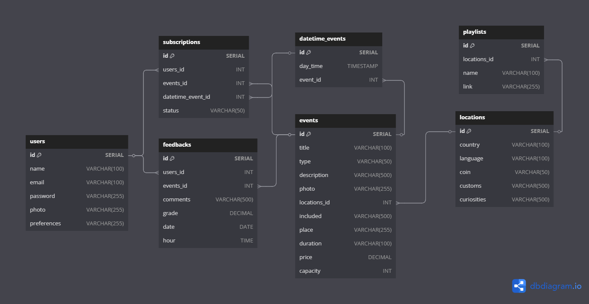
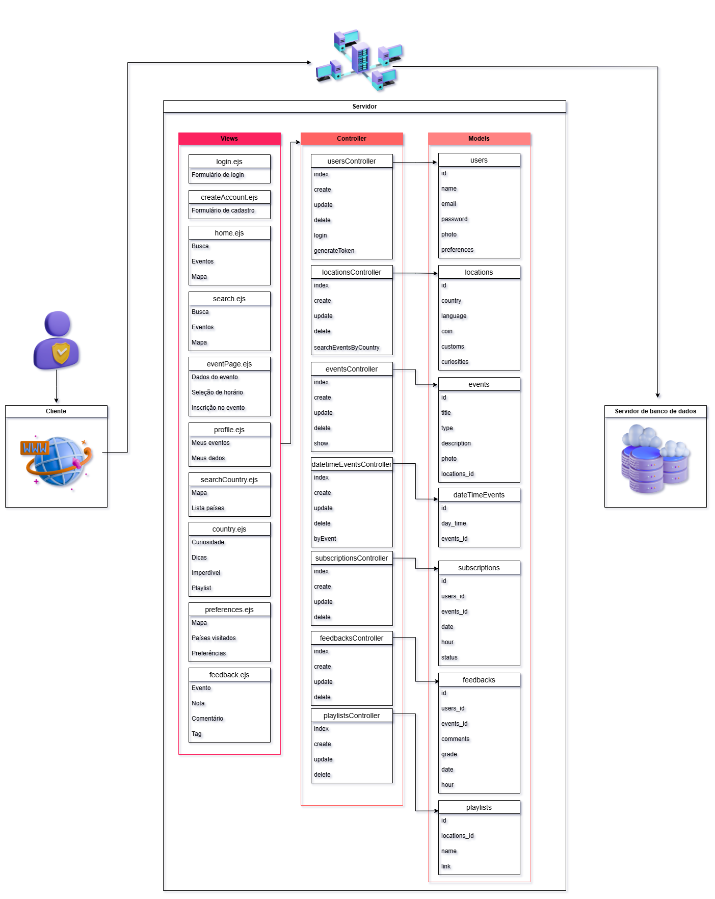
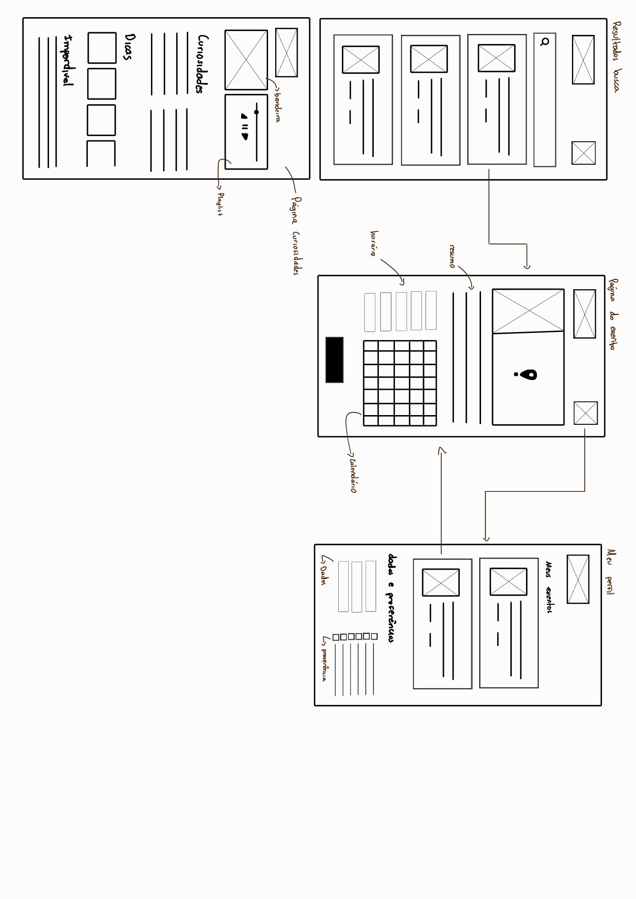

# Web Application Document - Projeto Individual - Módulo 2 - Inteli


## Vibra

#### Aira Mel 

## Sumário

1. [Introdução](#c1)  
2. [Visão Geral da Aplicação Web](#c2)  
3. [Projeto Técnico da Aplicação Web](#c3)  
4. [Desenvolvimento da Aplicação Web](#c4)  
5. [Referências](#c5)  

<br>

## <a name="c1"></a>1. Introdução (Semana 01)

&emsp;A aplicação web **Vibra** nasce da necessidade de oferecer uma experiência moderna, prática e escalável para viajantes e amantes da música. Utilizando apenas uma conexão com a internet, os usuários poderão acessar e gerenciar serviços de qualquer lugar do mundo, promovendo uma verdadeira imersão cultural.

&emsp;O **Vibra** é uma plataforma de eventos com gerenciamento de inscrições, criada para facilitar a conexão entre pessoas e experiências únicas ao redor do mundo. Desenvolvido especialmente para quem ama viajar e viver intensamente cada destino, o aplicativo recomenda eventos exclusivos baseados na localidade da viagem, como tours gastronômicos na Itália, aulas de samba no Rio de Janeiro e corridas emblemáticas em Mônaco.

&emsp;Além disso, a plataforma oferece uma área dedicada a informações culturais rápidas, dicas práticas, idiomas locais e costumes, para preparar o viajante antes de cada experiência. Com o **Vibra**, viajar vai além de conhecer lugares: é viver momentos inesquecíveis, com tudo o que importa na palma da mão.

---

## <a name="c2"></a>2. Visão Geral da Aplicação Web

### 2.1. Personas (Semana 01)

<div align="center">
<sub>Figura 1 - Persona - Vibra </sub>

<sup>Fonte: Autoria Própia, Faculdade Inteli 2025</sup>
</div>

### 2.2. User Stories (Semana 01)


> US01 | Como turista, quero descobrir eventos únicos enquanto viajo, para que eu possa viver cada destino profundamente e inesquecível.

> US02 | Como uma usuária que valoriza praticidade, quero me inscrever em eventos de forma rápida e segura, para garantir minha participação sem complicações e evitar filas ou processos demorados.

> US03 | Como uma amante de viagens culturais, quero receber recomendações de eventos, festas e atividades locais baseadas no meu perfil e destino, para otimizar minha experiência e tornar cada viagem inesquecível.

> US04 | | Sendo uma viajante conectada, quero acessar a aplicação diretamente pelo celular, para ter todas as funcionalidades disponíveis na palma da mão, sempre que eu estiver conectada à internet.
<br>

INVEST US02 <br>
**I - Independente**: O sistema de inscrição pode ser desenvolvido separado da descoberta de eventos.

**N - Negociável**: O fluxo de inscrição pode ser ajustado (por exemplo: via app, QR code, confirmação por email).

**V - Valiosa**: Inscrição fácil aumenta a adesão aos eventos.

**E - Estimável**: Consegue-se estimar fluxo de inscrição.

**S - Small**: É um pedaço pequeno e objetivo.

**T - Testável**: Pode-se testar simulando inscrições em eventos.

---

## <a name="c3"></a>3. Projeto da Aplicação Web

### 3.1. Modelagem do banco de dados  (Semana 3)

### **Introdução**
A modelagem de banco de dados da aplicação Vibra foi desenvolvida com o objetivo de estruturar e organizar as informações de forma lógica, funcional e segura. Considerando as principais funcionalidades da plataforma, como gerenciamento de eventos, inscrições, preferências culturais e interação dos usuários, o modelo busca garantir a eficiência no armazenamento, a consistência dos dados e o suporte à escalabilidade da aplicação.

Nesta seção, são apresentados o modelo relacional, que ilustra as entidades, seus atributos e os relacionamentos entre elas. Além disso, o modelo físico, com a estrutura em SQL (schema.sql) pronta para ser implementada em um sistema gerenciador de banco de dados relacional.

### **Modelo Relacional**
O modelo relacional é uma etapa fundamental no processo de modelagem de banco de dados, pois representa de forma clara e organizada as entidades, seus atributos e os relacionamentos entre elas. Ele conecta a análise conceitual e a implementação física do banco de dados, facilitando a visualização da estrutura da informação e permitindo identificar com precisão como os dados interagem dentro do sistema. No contexto da aplicação Vibra, o modelo relacional foi essencial para estruturar os dados de usuários, eventos, localidades, playlists e inscrições, assegurando a integridade das informações e otimizando a experiência do usuário com base em conexões reais e únicas entre cultura, música e viagem.

<div align="center">
<sub>Figura 2 - Modelo Banco de dados - Vibra </sub>

<sup>Fonte: Autoria Própia, Faculdade Inteli 2025</sup>
</div>
<br>

### **Modelo FÍsico**
O modelo físico representa a implementação concreta da estrutura do banco de dados, baseada no que foi definido no modelo relacional. Por meio da linguagem SQL, são criadas as tabelas, os campos e os relacionamentos que tornam possível o armazenamento e a manipulação dos dados dentro da aplicação. No caso da Vibra, o modelo físico foi projetado para garantir desempenho, organização e integridade, permitindo que informações como usuários, eventos, localidades e playlists sejam gerenciadas de forma eficiente.

### **Tabela** 
**Usuários (users)**: Representa as pessoas que utilizam a aplicação web.
- `id`: Identificador único do usuário (PK).
- `name`: Nome do usuário.
- `email`: Endereço de e-mail.
- `password`: Senha de acesso.
- `photo`: Foto de perfil.
- `preferences`: Interesses do usuário.

**Inscrições (subscriptions)**: Representa as inscrições dos usuários nos eventos.
- `id`: Identificador da inscrição (PK).
- `users_id`, `events_id`: Relacionam inscriçoes ao usuário e evento (FK).
- `status`: Situação da inscrição(confirmada, pendente, etc.).

**Feedback (feedbacks)**: Representa os feedbacks dos eventos.
- `id`: Identificador do Feedback (PK).
- `users_id`, `events_id`: Relacionam feedback ao usuário e evento (FK).
- `comments`: Comentário textual.
- `grade`: Nota ou avaliação numérica.
- `when`: Momento do feedback.

**Evento (events)**: Representa eventos cadastrados na aplicação web.
- `id`: Identificador do evento (PK).
- `title`,`type`, `description`, `photo`: Detalhes do evento.
- `when`: Data e hora do evento.
- `locations_id`: Localidade do evento (FK).

**Localidade (locations)**: Representa onde os evetntos acontecem.
- `id`: Identificador da localidade (PK)
- `country``language`, `coin`: Dados culturais do país.
- `customs`, `curiosities`: Costumes e curiosidades.

```SQL
CREATE TABLE IF NOT EXISTS "users" (
  "id" SERIAL PRIMARY KEY,
  "name" VARCHAR(100),
  "email" VARCHAR(100),
  "password" VARCHAR(255),
  "photo" VARCHAR(255),
  "preferences" VARCHAR(255)
);

CREATE TABLE IF NOT EXISTS "events" (
  "id" INT PRIMARY KEY,
  "title" VARCHAR(100),
  "type" VARCHAR(50),
  "description" VARCHAR(500),
  "photo" VARCHAR(255),
  "locations_id" INT
);

CREATE TABLE IF NOT EXISTS "locations" (
  "id" INT PRIMARY KEY,
  "country" VARCHAR(100),
  "language" VARCHAR(100),
  "coin" VARCHAR(50),
  "customs" VARCHAR(500),
  "curiosities" VARCHAR(500)
);

CREATE TABLE IF NOT EXISTS "subscriptions" (
  "id" INT PRIMARY KEY,
  "users_id" INT,
  "events_id" INT,
  "date" DATE,
  "hour" TIME,
  "status" VARCHAR(50)
);

CREATE TABLE IF NOT EXISTS "feedbacks" (
  "id" INT PRIMARY KEY,
  "users_id" INT,
  "events_id" INT,
  "comments" VARCHAR(500),
  "grade" DECIMAL,
  "date" DATE,
  "hour" TIME
);

CREATE TABLE IF NOT EXISTS "playlists" (
  "id" INT PRIMARY KEY,
  "locations_id" INT,
  "name" VARCHAR(100),
  "link" VARCHAR(255)
);
```
#### **Relacionamentos e Cardinalidade** 

**Usuário <-> Inscrições** 
- Um usuário pode se inscrever em vários eventos. (1:N)
- Cada inscrição pertence a um usuário.

**Evento <-> Inscrições** 
- Um evento pode ter vários inscritos. (1:N)
- Cada inscrição pertence a um evento.

**Usuário <-> Feedback** 
- Um usuário pode avaliar vários eventos. (1:N)
- Cada feedback pertence a um usuário.

**Evento <-> Feedback** 
- Um evento pode receber vários feedbacks. 
- Cada feedback pertence a um evento.

**Evento <-> Localidade**
- Um local pode receber vários eventos. 
- Cada evento ocorre em uma localidade. (N:1)

**Localidade <-> Playlist**
- Um local pode receber várias playlists. 
- Cada playlist ocorre em uma localidade.

```SQL
ALTER TABLE "subscriptions" ADD FOREIGN KEY ("users_id") REFERENCES "users" ("id");
ALTER TABLE "subscriptions" ADD FOREIGN KEY ("events_id") REFERENCES "events" ("id");

ALTER TABLE "events" ADD FOREIGN KEY ("locations_id") REFERENCES "locations" ("id");

ALTER TABLE "feedbacks" ADD FOREIGN KEY ("users_id") REFERENCES "users" ("id");
ALTER TABLE "feedbacks" ADD FOREIGN KEY ("events_id") REFERENCES "events" ("id");

ALTER TABLE "playlists" ADD FOREIGN KEY ("locations_id") REFERENCES "locations" ("id");
```

A modelagem do banco de dados da aplicação Vibra organiza as entidades principais, como eventos, inscrições, playlists e feedbacks, proporcionando uma experiência fluida para os usuários. A estrutura também facilita futuras expansões, como integração com redes sociais e novos conteúdos.


### 3.1.1 BD e Models (Semana 5)

#### BD

O arquivo `db.js` é responsável por configurar e gerenciar a conexão com o banco de dados **PostgreSQL** utilizado na aplicação Vibra. Ele utiliza a biblioteca `pg`, um cliente PostgreSQL para Node.js, amplamente adotado em projetos web.

```js
const { Pool } = require('pg');
require('dotenv').config();

const isSSL = process.env.DB_SSL === 'true';

const pool = new Pool({
  user: process.env.DB_USER,
  host: process.env.DB_HOST,
  database: process.env.DB_DATABASE,
  password: process.env.DB_PASSWORD,
  port: process.env.DB_PORT,
  ssl: isSSL ? { rejectUnauthorized: false } : false,
});

module.exports = {
  query: (text, params) => pool.query(text, params),
  connect: () => pool.connect(),
};
```
Essa implementação garante que a comunicação com o banco de dados seja feita de forma eficiente, segura e centralizada, promovendo boas práticas no desenvolvimento do backend da aplicação.

#### Models

Nesta etapa do projeto, foram definidos os **models** responsáveis por realizar a comunicação entre a aplicação e o banco de dados **PostgreSQL**, utilizando queries SQL por meio da biblioteca `pg`. Cada model representa uma entidade da aplicação e encapsula as operações CRUD (Create, Read, Update, Delete).

Abaixo, exemplo da estrutura do model `event`, responsável por manipular os dados da tabela `events`.

Arquivo: `models/eventsModel.js`

Este model gerencia os dados dos eventos culturais disponíveis na aplicação. Ele contém métodos para criar, buscar, atualizar e deletar registros da tabela `events`.

**Atributos armazenados:**
- `id`: identificador único do evento (gerado automaticamente)
- `title`: título do evento
- `type`: tipo ou categoria (ex: música, teatro)
- `description`: descrição detalhada do evento
- `photo`: URL de imagem representando o evento
- `locations_id`: referência ao local onde o evento será realizado (chave estrangeira)

**Métodos implementados:**

```js
// Criação de um novo evento
async create(data) {
  const query = 'INSERT INTO Events (title, type, description, photo, locations_id) VALUES ($1, $2, $3, $4, $5) RETURNING *';
  const values = [data.title, data.type, data.description, data.photo, data.location_id];
  return db.query(query, values);
}

// Consulta de todos os eventos
async findAll() {
  const result = await db.query('SELECT id, title, type, description, photo, locations_id FROM events ORDER BY id ASC');
  return result.rows;
}

// Atualização de um evento por ID
async update(id, data) {
  const query = 'UPDATE Events SET title = $1, type = $2, description = $3, photo = $4, locations_id = $5 WHERE id = $6 RETURNING *';
  const values = [data.type, data.description, data.photo, data.location_id, id];
  return db.query(query, values);
}

// Exclusão de um evento por ID
async delete(id) {
  const query = 'DELETE FROM events WHERE id = $1 RETURNING *';
  return db.query(query, [id]);
}
```
A estrutura de models implementada no projeto segue princípios fundamentais de organização e desacoplamento da lógica de acesso a dados. Cada entidade possui responsabilidades definidas, encapsulando suas operações em módulos separados. Essa abordagem facilita a manutenção do sistema, permitindo que atualizações, correções e expansões futuras sejam feitas de maneira mais eficiente e segura.

Esses models são a base das operações CRUD realizadas pela API e foram organizados conforme os princípios da arquitetura MVC. A definição dos relacionamentos entre entidades garante a integridade dos dados e facilita a construção de funcionalidades como:

- Listagem de eventos com usuários inscritos
- Consulta de eventos em que um usuário está inscrito
- Validação de dados na criação de eventos e usuários


### 3.2. Arquitetura (Semana 5)

O desenvolvimento da aplicação Vibra segue o padrão arquitetural MVC (Model-View-Controller), uma abordagem que separa as responsabilidades da aplicação em três camadas principais: Model, View e Controller. Isso garante maior organização, escalabilidade e facilidade de manutenção do código.

O diagrama abaixo representa a arquitetura da aplicação, evidenciando a forma como os dados fluem entre cliente, servidor e banco de dados:

<div align="center">
<sub>Figura 4 - Diagrama arquitetura MVC - Vibra </sub>

<sup>Fonte: Autoria Própia, Faculdade Inteli 2025</sup>
</div>

#### **View (Visualização)**
A camada responsável pela interface com o usuário. É por meio dela que os usuários interagem com a aplicação. No momento, essa camada ainda será implementada, mas sua função será apresentar os dados processados pela Controller de forma clara e intuitiva.

#### **Controller (Controle)**
Atua como intermediária entre a View e o Model. Recebe as requisições feitas pelos usuários (por exemplo, criar uma conta, buscar eventos ou deixar feedback), processa essas ações e, se necessário, comunica-se com o Model para manipular os dados. No projeto, temos controllers específicos para cada entidade: `usersController`, `locationsController`, `eventsController`, `subscriptionsController`, `feedbacksController` e `playlistsController`.

#### **Model (Modelo)**
A camada que lida diretamente com a lógica de negócios e com o banco de dados. É responsável por representar e gerenciar os dados da aplicação. Cada model representa uma tabela no banco de dados (ex: users, locations, events, etc), incluindo seus atributos e relacionamentos.

Esse padrão permite que cada parte da aplicação seja modificada de forma independente. Assim, a arquitetura MVC torna o projeto Vibra mais modular, seguro e fácil de evoluir conforme novas funcionalidades forem implementadas.

### 3.3. Wireframes (Semana 03)

Os wireframes são representações visuais simples e estruturadas das telas da aplicação. Eles têm como objetivo demonstrar, de forma clara e organizada, a disposição dos elementos e a arquitetura da interface antes do design final ser aplicado, com isso, **auxiliam o UX Designer na diagramação e aplicação da identidade visual;** e **alinham a expectativa do cliente quanto ao que o usuário quer e ao projeto criado**. 

#### Wireframes de baixa fidelidade

<div align="center">
<sub>Figura 3 - Wireframe - Vibra </sub>

<sup>Fonte: Autoria Própia, Faculdade Inteli 2025</sup>
</div>

<div align="center">
<sub>Figura 4 - Wireframe - Vibra </sub>

<sup>Fonte: Autoria Própia, Faculdade Inteli 2025</sup>
</div>

As telas desenhadas contemplam desde a apresentação inicial da plataforma, passando por login, criação de conta, exploração de países e eventos, até o gerenciamento de perfil e preferências do usuário. A estrutura clara e direta das telas contribui para uma navegação fluida, reforçando a proposta de uma aplicação intuitiva, acessível e centrada na experiência do usuário.

O wireframe foi desenvolvido com base nas user stories, que representam as reais necessidades dos usuários da aplicação. Para atender à US04, que destaca o desejo por usabilidade e acessibilidade, a plataforma foi projetada no formato mobile, facilitando o uso durante viagens, sem depender de um desktop.

A experiência do usuário começa pela tela inicial, que apresenta a proposta da plataforma e incentiva o cadastro no Vibra. Em seguida, o usuário é direcionado para a tela de login, da qual pode acessar sua conta ou criar um novo cadastro, caso ainda não tenha um perfil. Após esse processo, há uma etapa de personalização, onde o usuário pode definir preferências relacionadas a países já visitados, idiomas e culturas de interesse, funcionalidade que atende diretamente à US03, ao tornar a plataforma mais alinhada com o perfil individual de cada pessoa.

Na tela principal da aplicação (home), o usuário tem acesso a uma barra de busca para procurar eventos específicos, recebe recomendações personalizadas e pode navegar entre as páginas de países e o seu próprio perfil. As recomendações destacam eventos variados e imperdíveis, alinhando-se à US01, que foca em despertar o interesse por experiências culturais únicas.

Ao selecionar um país, o usuário é levado a uma página com curiosidades, dicas e uma playlist local, promovendo uma imersão cultural mais rica. Se optar por utilizar a busca, encontrará eventos compatíveis com seu perfil e, ao escolher um deles, será direcionado a uma página dedicada ao evento, com informações detalhadas, avaliações de outros usuários e a opção de inscrição, atendendo à US02, com foco em garantir uma interação segura e confiável.

A página de perfil permite ao usuário visualizar e editar seus dados e preferências, acompanhar os eventos em que está inscrito e deixar feedbacks sobre os que participou, fortalecendo a relação entre o usuário e a plataforma de forma contínua e personalizada.

### 3.4. Guia de estilos (Semana 05)

O guia de estilos foi desenvolvido para garantir consistência visual e reforçar a identidade da plataforma Vibra. Ele reúne os principais elementos gráficos utilizados no projeto, como cores, tipografia, botões, ícones e componentes, orientando na criação de interfaces coesas e intuitivas.

A proposta estética reflete os valores da marca: movimento, energia e conexão cultural. A escolha das cores vibrantes, a tipografia moderna e os elementos minimalistas foram pensados para criar uma experiência envolvente, acessível e inspiradora para usuários ao redor do mundo.

#### **Paleta de cores**

A identidade visual do Vibra é marcada por tons quentes e vibrantes, que transmitem energia, acolhimento e diversidade cultural. A paleta principal é composta por:

- #FF6363 – Rosa vibrante, usado para elementos de destaque e interação.
- #CC4C5A – Vermelho escuro, que transmite profundidade e contraste.  
- #FF8282 – Rosa claro, aplicado em fundos suaves ou realces secundários.
- #FFFFFF – Branco, utilizado para equilíbrio e espaços negativos.
- #333333 – Cinza escuro, ideal para textos e legibilidade.

<div align="center">
<sub>Figura 4 - Paleta de cores - Vibra </sub>

<sup>Fonte: Autoria Própia, Faculdade Inteli 2025</sup>
</div>

#### **Tipografia**
A fonte escolhida para a plataforma, Sora, é moderna, legível e amigável, garantindo uma leitura confortável em diferentes tamanhos de tela. O estilo tipográfico estabelece uma hierarquia clara entre títulos, subtítulos e textos:

- Títulos (H1, H2): Negrito, destaque e impacto visual.
- Subtítulos e sessões (H3, H4): Peso médio, orientação e clareza.
- Texto padrão e parágrafos: Leve, com foco em fluidez e legibilidade.
- Botões e menus: Caixa alta ou destaque sutil, com contraste adequado.

<div align="center">
<sub>Figura 4 - Wireframe - Vibra </sub>

<sup>Fonte: Autoria Própia, Faculdade Inteli 2025</sup>
</div>

#### **Ícones**
Os ícones são minimalistas e seguem uma linha clara, com proporções uniformes. Eles reforçam a ação visualmente e facilitam a navegação, sendo utilizados em menus, botões e seções informativas.
<div align="center">
<sub>Figura 4 - Ícones - Vibra </sub>

<sup>Fonte: Autoria Própia, Faculdade Inteli 2025</sup>
</div>

#### **Componentes**
Os componentes foram criados para garantir consistência visual e facilitar a manutenção da interface. Elementos como cards de evento, campos de busca, botões e seções de perfil seguem padrões de espaçamento, tipografia e cores definidos no guia, promovendo uma experiência coesa e intuitiva para o usuário.
<div align="center">
<sub>Figura 4 - Componentes - Vibra </sub>

<sup>Fonte: Autoria Própia, Faculdade Inteli 2025</sup>
</div>

#### **Acesso ao Figma**

Para visualização completa do **guia de estilos** e do **design system**, acesse os arquivos no Figma pelos links abaixo:

- [Guia de Estilos no Figma](https://www.figma.com/design/8gX8vSk4MDCOcZRkOv70lw/Projeto-individual?node-id=9-311&t=qG1GqaxuU5wDfTGj-1)
- [Design System no Figma](https://www.figma.com/design/8gX8vSk4MDCOcZRkOv70lw/Projeto-individual?node-id=231-1713&t=qG1GqaxuU5wDfTGj-1)

Esses documentos reúnem as definições visuais e os principais elementos reutilizáveis da interface, servindo como referência para o desenvolvimento do produto.

### 3.5. Protótipo de alta fidelidade (Semana 05)

O protótipo de alta fidelidade representa uma versão visual próxima do produto final, integrando a identidade visual, os componentes definidos no design system e a experiência pensada a partir das necessidades dos usuários. Através dele, é possível visualizar o fluxo de navegação, testar interações e validar decisões de design antes do desenvolvimento.

<div align="center">
<sub>Figura 4 - Protótipo - Vibra </sub>

<sup>Fonte: Autoria Própia, Faculdade Inteli 2025</sup>
</div>

O protótipo de alta fidelidade do Vibra foi desenvolvido com base nas necessidades levantadas nas histórias de usuário e nos objetivos centrais da plataforma: promover experiências culturais autênticas de forma acessível e intuitiva. As telas foram desenhadas para dispositivos móveis, priorizando a usabilidade em contextos de mobilidade, como viagen

Para visualização completa acesse os arquivos no Figma pelos links abaixo:

- [Protótipo](https://www.figma.com/design/8gX8vSk4MDCOcZRkOv70lw/Projeto-individual?node-id=147-3858&t=qG1GqaxuU5wDfTGj-1)
- [Protótipo Interativo](https://www.figma.com/design/8gX8vSk4MDCOcZRkOv70lw/Projeto-individual?node-id=147-4899&t=qG1GqaxuU5wDfTGj-1)

### 3.6. WebAPI e endpoints (Semana 05)


Nesta seção, é apresentada a estrutura de WebAPI desenvolvida para o projeto Vibra, uma plataforma para gestão e divulgação de eventos. A aplicação foi construída utilizando Node.js com Express e banco de dados PostgreSQL. A WebAPI é responsável por disponibilizar os recursos do sistema para o front-end, permitindo operações como criação de usuários, autenticação, cadastro de eventos e inscrições.

Os **endpoints** são componentes essenciais de qualquer aplicação web moderna. Eles definem como a aplicação responde a solicitações HTTP (como GET, POST, PUT e DELETE), funcionando como pontos de acesso à lógica de negócios e ao banco de dados.

No contexto do projeto **Vibra**, os endpoints foram implementados utilizando o framework **Express.js**, com estrutura baseada no padrão **MVC (Model-View-Controller)**. Cada rota é mapeada para uma ação específica em um controller, o que garante organização, modularidade e manutenibilidade ao sistema.

A WebAPI da aplicação foi pensada para permitir que usuários possam:

- Criar contas e realizar login (com autenticação via JWT)
- Visualizar, criar, editar e deletar eventos
- Realizar e consultar inscrições em eventos

Essa estrutura também facilita a integração com interfaces front-end e serviços externos, promovendo flexibilidade e escalabilidade à aplicação.

A seguir, uma amostra das rotas implementadas e seus respectivos controllers:

---

```js

// ROTAS DE EVENTO
GET    /events                  → eventsController.index // Lista todos os eventos
POST   /events                  → eventsController.create // Cria um novo evento
PUT    /events/:id              → eventsController.update // Atualiza um evento
DELETE /events/:id              → eventsController.delete // Exclui um evento

```

Cada rota acima representa uma operação disponível para os usuários da aplicação.

#### Controle de Eventos

| Método | Rota | Controller & Função | Descrição |
|--------|------|--------------------|------------|
| `GET` | `/events` | `eventsController.index` | Lista todos os eventos |
| `POST` | `/events` | `eventsController.create` | Cria um novo evento |
| `PUT` | `/events/:id` | `eventsController.update` | Atualiza um evento |
| `DELETE` | `/events/:id` | `eventsController.delete` | Exclui um evento |


Esses endpoints são fundamentais para o funcionamento da aplicação Vibra, pois determinam como as interações com o sistema ocorrem. Além disso, com a autenticação por token, as rotas protegidas garantem que apenas usuários autenticados possam realizar ações sensíveis, como criar eventos ou se inscrever neles.


### 3.7 Interface e Navegação (Semana 07)

*Descreva e ilustre aqui o desenvolvimento do frontend do sistema web, explicando brevemente o que foi entregue em termos de código e sistema. Utilize prints de tela para ilustrar.*

---

## <a name="c4"></a>4. Desenvolvimento da Aplicação Web (Semana 8)

### 4.1 Demonstração do Sistema Web (Semana 8)

*VIDEO: Insira o link do vídeo demonstrativo nesta seção*
*Descreva e ilustre aqui o desenvolvimento do sistema web completo, explicando brevemente o que foi entregue em termos de código e sistema. Utilize prints de tela para ilustrar.*

### 4.2 Conclusões e Trabalhos Futuros (Semana 8)

*Indique pontos fortes e pontos a melhorar de maneira geral.*
*Relacione também quaisquer outras ideias que você tenha para melhorias futuras.*


## <a name="c5"></a>5. Referências

_Incluir as principais referências de seu projeto, para que seu parceiro possa consultar caso ele se interessar em aprofundar. Um exemplo de referência de livro e de site:_<br>

---
---